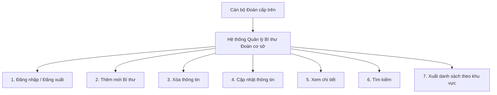
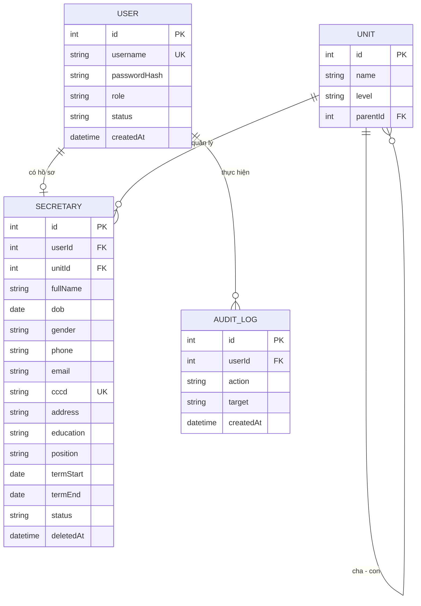

# Phân tích nghiệp vụ & Đề xuất hệ thống — Module 1: Cán bộ Đoàn cấp trên

> Nguồn: tài liệu `2__YC2.docx` — *Đặc tả yêu cầu của Cán bộ Đoàn cấp trên (DTYC1)*

| Mục | Nội dung |
|---|---|
| Trường / Viện | Trường Đại học Tài chính Ngân hàng Hà Nội — Viện Công nghệ Thông tin |
| Chương trình | Hệ thống Quản lí Công tác Đoàn thông minh (`HTQLCTDTM`) |
| Module | Module 1 – Cán bộ Đoàn cấp trên (`M1`) |
| Tài liệu | Đặc tả yêu cầu của Cán bộ Đoàn cấp trên (`DTYC1`) |
| Người thực hiện | Nguyễn Thị Triều (`N1`) |
| Thời gian / Phiên bản | *(chưa điền trong tài liệu gốc)* |

---

## Mục lục

1. [Tổng quan](#1-tổng-quan)
2. [Yêu cầu nghiệp vụ chức năng](#2-yêu-cầu-nghiệp-vụ-chức-năng)
3. [Đặc tả các use case đã có](#3-đặc-tả-các-use-case-đã-có)
4. [Quy tắc nghiệp vụ](#4-quy-tắc-nghiệp-vụ)
5. [Yêu cầu dữ liệu](#5-yêu-cầu-dữ-liệu)
6. [Yêu cầu giao diện](#6-yêu-cầu-giao-diện)
7. [Yêu cầu phi chức năng & hệ thống (theo tài liệu gốc)](#7-yêu-cầu-phi-chức-năng--hệ-thống-theo-tài-liệu-gốc)
8. [Độ phủ giữa các phần của tài liệu](#8-độ-phủ-giữa-các-phần-của-tài-liệu)
9. [Vấn đề cần làm rõ hoặc sửa](#9-vấn-đề-cần-làm-rõ-hoặc-sửa)
10. [Đề xuất công nghệ (project cá nhân)](#10-đề-xuất-công-nghệ-project-cá-nhân)
11. [Mô hình dữ liệu đề xuất](#11-mô-hình-dữ-liệu-đề-xuất)
12. [Danh sách API đề xuất](#12-danh-sách-api-đề-xuất)
13. [Lộ trình thực hiện](#13-lộ-trình-thực-hiện)

---

## 1. Tổng quan

### 1.1. Bối cảnh hệ thống

Hệ thống Quản lý Công tác Đoàn Thông minh nhằm số hóa và tự động hóa quy trình quản lý hoạt động Đoàn tại địa phương. Tài liệu gốc mô tả kiến trúc gồm ba thành phần:

| Thành phần | Vai trò |
|---|---|
| **WordPress** | Hệ thống lõi: giao diện, cơ sở dữ liệu (đoàn viên, công văn, nhiệm vụ), phân quyền |
| **Make.com** | Tự động hóa luồng công việc, truyền dữ liệu giữa WordPress và AI |
| **AI (Gemini / OpenAI API)** | OCR/bóc tách công văn, tóm tắt, phân loại, trợ lý ảo, phân tích xu hướng |

### 1.2. Mục tiêu của hệ thống

- Cắt giảm **70%** thời gian bóc tách và xử lý hành chính (AI OCR công văn).
- Tự động hóa giao việc: AI gợi ý bộ khung hành động (Action Plan) theo từng khối.
- Hỗ trợ giải đáp nghiệp vụ **24/7** qua chatbot có kho tri thức (Điều lệ Đoàn, hướng dẫn nghiệp vụ).

### 1.3. Tác nhân: Cán bộ Đoàn cấp trên

Ban Chấp hành / Thường trực Đoàn cấp Huyện, Thành phố hoặc Xã, Phường. Vai trò:

- Tiếp nhận chủ trương, nghị quyết từ cấp trên và cấp ủy Đảng, cụ thể hóa thành văn bản chỉ đạo.
- Giao nhiệm vụ, áp chỉ tiêu cho các cơ sở Đoàn trực thuộc.
- Kiểm tra, đôn đốc, đánh giá thi đua cấp dưới.

### 1.4. Phạm vi thực tế của Module M1

Module M1 tập trung vào **quản lý hồ sơ và tài khoản Bí thư Đoàn cơ sở**. Bản chất là bài toán CRUD + tìm kiếm + báo cáo. **Chưa có phần AI nào** trong chức năng M1.



---

## 2. Yêu cầu nghiệp vụ chức năng

| Mã | Nghiệp vụ | Nội dung chính | Mức độ dùng |
|---|---|---|---|
| BR1 | Đăng nhập / đăng xuất | Xác thực, phân quyền theo vai trò, đổi mật khẩu, quản lý phiên | Cao |
| BR2 | Thêm mới Bí thư cơ sở | Khi có địa phương mới hoặc thay đổi Bí thư; nhập hồ sơ, chọn đơn vị, cấp tài khoản | Trung bình |
| BR3 | Cập nhật thông tin | Sửa họ tên, ngày sinh, SĐT, địa chỉ, trình độ, tình trạng hôn nhân… | *(không nêu)* |
| BR4 | Xem chi tiết | Thông tin cá nhân, đơn vị, quá trình công tác, chức danh, liên hệ, tài khoản, thống kê đoàn viên quản lý | *(không nêu)* |
| BR5 | Tìm kiếm / lọc | Theo họ tên, địa chỉ, chi đoàn, khu vực… | Cao |
| BR6 | Xóa thông tin | Khi Bí thư không còn đảm nhiệm hoặc thay đổi bộ máy chính quyền | Trung bình |
| BR7 | Xuất danh sách theo khu vực | Số Bí thư, Phó Bí thư, Đoàn viên quản lý; xuất Excel/PDF, in | *(không nêu)* |
| BR8 | Cấp tài khoản | Tạo, kích hoạt, tạm khóa tài khoản cho Bí thư | *(không nêu)* |

### 2.1. Phân rã chức năng (theo sơ đồ trong tài liệu)

| Nhóm | Chức năng con |
|---|---|
| **1. Đăng nhập / đăng xuất** | 1.1 Đăng nhập · 1.2 Xác thực (username/password, OTP nếu có) · 1.3 Đổi mật khẩu · 1.4 Quản lý phiên · 1.5 Đăng xuất |
| **2. Thêm mới Bí thư** | 2.1 Nhập thông tin · 2.2 Chọn đơn vị/địa phương · 2.3 Phân quyền tài khoản · 2.4 Kiểm tra, xác nhận · 2.5 Lưu và tạo tài khoản · 2.6 Thông báo thành công |
| **3. Xóa thông tin** | 3.1 Tìm Bí thư cần xóa · 3.2 Xem chi tiết · 3.3 Xác nhận xóa (tài khoản + dữ liệu liên quan) · 3.4 Cập nhật trạng thái không còn hoạt động · 3.5 Lưu log thao tác · 3.6 Thông báo kết quả |
| **4. Cập nhật thông tin** | 4.1 Tìm Bí thư cần cập nhật · 4.2 Chỉnh sửa thông tin · 4.3 Kiểm tra, xác nhận · 4.4 Lưu cập nhật · 4.5 Thông báo thành công |
| **5. Xem chi tiết** | 5.1 Tìm kiếm/chọn Bí thư · 5.2 Hiển thị thông tin (cá nhân, đơn vị, quá trình công tác, chức danh, liên hệ, tài khoản, thống kê đoàn viên) · 5.3 In/Export |
| **6. Tìm kiếm** | 6.1 Chọn tiêu chí · 6.2 Nhập từ khóa · 6.3 Thực hiện · 6.4 Hiển thị kết quả · 6.5 Xem chi tiết từ kết quả · 6.6 Làm mới bộ lọc |
| **7. Xuất danh sách theo khu vực** | 7.1 Chọn khu vực (xã/phường) · 7.2 Tổng hợp (số Bí thư, Phó Bí thư, Đoàn viên quản lý) · 7.3 Hiển thị báo cáo · 7.4 Xuất Excel/PDF · 7.5 In báo cáo |

**Nguyên tắc chung (theo sơ đồ):** mọi thao tác thêm / sửa / xóa / xem / tìm / xuất đều phải được **ghi log và kiểm soát quyền**.

---

## 3. Đặc tả các use case đã có

Tài liệu mới đặc tả đầy đủ **4/8** nghiệp vụ.

### UC1 — Đăng nhập

| Thuộc tính | Nội dung |
|---|---|
| Mục đích | Phân quyền người dùng |
| Tác nhân | Cán bộ Đoàn cấp trên |
| Điều kiện thành công | Nhập đúng thông tin đăng nhập |
| Kích hoạt | Chọn chức năng Đăng nhập |
| Mức độ sử dụng | **Cao** |

**Luồng chính:** nhập thông tin → gửi tới lớp xử lý → so khớp CSDL → xác nhận hợp lệ → cho phép truy cập → hiển thị thông báo và chuyển trang (Dashboard).
**Ngoại lệ:** nhập sai → từ chối truy cập → thông báo yêu cầu nhập lại.

### UC2 — Thêm mới Bí thư cơ sở

| Thuộc tính | Nội dung |
|---|---|
| Mục đích | Thêm dữ liệu Bí thư cơ sở khi có người mới |
| Tác nhân | Cán bộ Đoàn cấp trên |
| Điều kiện thành công | Dữ liệu đầy đủ và đúng định dạng |
| Kích hoạt | Đã đăng nhập; chọn "Thêm mới Bí thư cơ sở" |
| Mức độ sử dụng | Trung bình |

**Luồng chính:** mở form (tải danh mục Đơn vị, Khu vực, Chi đoàn) → nhập thông tin và ảnh đại diện → nhấn "Lưu" → kiểm tra dữ liệu → lưu CSDL → thông báo thành công, cập nhật danh sách.
**Ngoại lệ:** dữ liệu không hợp lệ hoặc để trống → hiển thị thông báo lỗi.

### UC3 — Tìm kiếm Bí thư cơ sở

| Thuộc tính | Nội dung |
|---|---|
| Mục đích | Tìm và lọc danh sách Bí thư theo tiêu chí |
| Tác nhân | Cán bộ Đoàn cấp trên |
| Điều kiện thành công | Có kết quả phù hợp, hiển thị chính xác |
| Kích hoạt | Đã đăng nhập; đang ở danh sách Bí thư; nhập tiêu chí |
| Mức độ sử dụng | **Cao** |

**Luồng chính:** nhập tiêu chí → nhấn "Tìm kiếm" → truy vấn CSDL theo điều kiện lọc → hiển thị kết quả.
**Ngoại lệ:** không có kết quả → hiển thị "Không tìm thấy kết quả".

### UC4 — Xóa dữ liệu Bí thư cơ sở

| Thuộc tính | Nội dung |
|---|---|
| Mục đích | Loại bỏ dữ liệu Bí thư không còn đảm nhiệm chức vụ |
| Tác nhân | Cán bộ Đoàn cấp trên |
| Điều kiện thành công | Bí thư tồn tại; người dùng xác nhận; không có ràng buộc dữ liệu với chức năng khác |
| Kích hoạt | Đã đăng nhập; chọn "Xóa dữ liệu" sau khi tìm kiếm |
| Mức độ sử dụng | Trung bình |

**Luồng chính:** chọn Bí thư → gửi yêu cầu xóa → kiểm tra điều kiện (có đang tại chức?) → xóa khỏi CSDL → thông báo thành công.
**Ngoại lệ:** Bí thư đang tại chức (trong nhiệm kỳ) → CSDL trả lỗi ràng buộc → hiển thị lỗi.

---

## 4. Quy tắc nghiệp vụ

| Mã | Quy tắc |
|---|---|
| RB1 | Phải đăng nhập trước khi dùng mọi chức năng; sai thông tin thì từ chối và yêu cầu nhập lại. |
| RB2 | Thêm mới chỉ thành công khi dữ liệu đầy đủ và đúng định dạng. |
| RB3 | Trường bắt buộc trên form thêm mới: họ tên, ngày sinh, giới tính, SĐT, CCCD/CMND, đơn vị cơ sở, chức vụ, ngày bắt đầu nhiệm kỳ, tên đăng nhập, mật khẩu. |
| RB4 | Mật khẩu tối thiểu 6 ký tự, gồm chữ và số (theo giao diện). |
| RB5 | **Không được xóa Bí thư đang tại chức** (đang trong nhiệm kỳ). |
| RB6 | Chỉ xóa khi bản ghi tồn tại, người dùng xác nhận và không còn ràng buộc dữ liệu. |
| RB7 | Trạng thái Bí thư: *Đang hoạt động / Đã kết thúc*. Trạng thái tài khoản: *Kích hoạt / Tạm khóa*. |
| RB8 | Mọi thao tác thêm/sửa/xóa/xem/tìm/xuất đều ghi log và kiểm soát quyền (RBAC). |
| RB9 | Khi sửa, để trống mật khẩu nghĩa là giữ nguyên mật khẩu cũ. |

---

## 5. Yêu cầu dữ liệu

### 5.1. Thông tin Bí thư cơ sở (theo form giao diện)

| Nhóm | Trường | Bắt buộc |
|---|---|---|
| Cá nhân | Họ và tên | ✔ |
| | Ngày sinh | ✔ |
| | Giới tính (Nam/Nữ/Khác) | ✔ |
| | Số điện thoại | ✔ |
| | Số CCCD/CMND | ✔ |
| | Ngày cấp, Nơi cấp | |
| | Email | |
| | Dân tộc, Tôn giáo | |
| | Địa chỉ thường trú | |
| Chức vụ | Đơn vị cơ sở | ✔ |
| | Chức vụ (mặc định "Bí thư Đoàn cơ sở", khóa) | ✔ |
| | Ngày bắt đầu nhiệm kỳ | ✔ |
| | Nhiệm kỳ (vd. 2024 – 2027) | |
| Tài khoản | Tên đăng nhập | ✔ |
| | Mật khẩu / Xác nhận mật khẩu | ✔ |

### 5.2. Trường có trong mô tả nhưng chưa có trên form

Trình độ học vấn · Trình độ đào tạo · Tình trạng hôn nhân · Ảnh đại diện · Chi đoàn · Khu vực.

### 5.3. Báo cáo theo khu vực Xã/Phường

Số lượng Bí thư · Số lượng Phó Bí thư · Số lượng Đoàn viên quản lý.

### 5.4. Ràng buộc dữ liệu (mục 3.2 của tài liệu gốc — chỉ có tiêu đề)

Định danh duy nhất · ràng buộc thời gian · bắt buộc nhập (Not Null) · tính liên kết dữ liệu. Nội dung chi tiết chưa được viết.

---

## 6. Yêu cầu giao diện

| Mục | Màn hình | Thành phần chính |
|---|---|---|
| 4.1 | Đăng nhập | Tên đăng nhập, mật khẩu, chọn vai trò, ghi nhớ, quên mật khẩu, đăng nhập Đoàn TNCS HCM / SSO |
| 4.2 | Thêm mới Bí thư | Form 3 nhóm: Thông tin cá nhân · Chức vụ · Tài khoản; nút "Nhập lại", "Lưu thông tin" |
| 4.3 | Cấp tài khoản | Form tài khoản (đơn vị, họ tên, email, vai trò, tên đăng nhập, mật khẩu, trạng thái kích hoạt) + bảng tài khoản đã cấp (sửa, khóa, xóa) |
| 4.4 | Sửa / Cập nhật | Form giống thêm mới, dữ liệu điền sẵn; mật khẩu để trống nếu không đổi |
| 4.5 | Tìm kiếm | Bộ lọc: đơn vị cơ sở, họ tên, SĐT, trạng thái, ngày bắt đầu/kết thúc nhiệm kỳ; bảng kết quả (xem / sửa / xóa) |
| 4.6 | Danh sách | Bảng có checkbox, phân trang, nút "Tìm kiếm", "Thêm mới", "Xuất Excel" |
| 4.7 | Xóa | Hộp thoại xác nhận (hiển thị họ tên, đơn vị; cảnh báo "không thể hoàn tác"), toast thành công, xóa hàng loạt |

Menu bên trái: Trang chủ · Quản lý tài khoản · Quản lý cán bộ · Báo cáo – Thống kê · Hệ thống (Cài đặt, Nhật ký hoạt động, Hướng dẫn sử dụng).

---

## 7. Yêu cầu phi chức năng & hệ thống (theo tài liệu gốc)

| Nhóm | Yêu cầu |
|---|---|
| Chính xác | AI OCR văn bản tối thiểu 90% |
| Bảo mật | HTTPS cho API, RBAC, bảo mật prompt nội bộ |
| Hiệu năng | AI xử lý công văn < 15 giây; chatbot phản hồi < 3 giây |
| Sẵn sàng | Hàng đợi (queue) lưu thông báo nhắc lịch khi mất kết nối API |
| Hạ tầng | WordPress hosting + plugin AI Engine |
| Tích hợp | Tài khoản Make.com, API key Gemini/OpenAI |

> Lưu ý: hầu hết yêu cầu trên thuộc các module AI/công văn, **chưa gắn với chức năng của M1**.

---

## 8. Độ phủ giữa các phần của tài liệu

| Chức năng | Sơ đồ phân rã | Use case | Biểu đồ tuần tự | Giao diện |
|---|:---:|:---:|:---:|:---:|
| Đăng nhập | ✔ | ✔ | ✔ | ✔ |
| Đăng xuất / đổi mật khẩu / quản lý phiên | ✔ | ✘ | ✘ | ✘ |
| Thêm mới | ✔ | ✔ | ✔ | ✔ |
| Cấp tài khoản | ✔ | ✘ | ✘ | ✔ |
| Cập nhật | ✔ | ✘ | ✘ | ✔ |
| Xem chi tiết | ✔ | ✘ | ✘ | ✘ (chỉ có icon) |
| Tìm kiếm | ✔ | ✔ | ✔ | ✔ |
| Xóa | ✔ | ✔ | ✔ | ✔ |
| Xuất danh sách theo khu vực | ✔ | ✘ | ✘ | Chỉ có nút "Xuất Excel" |

---

## 9. Vấn đề cần làm rõ hoặc sửa

### 9.1. Nghiêm trọng (ảnh hưởng thiết kế)

1. **Xóa: ba cách hiểu mâu thuẫn.**
   - Use case: xóa cứng khỏi CSDL.
   - Sơ đồ phân rã (3.4): "cập nhật trạng thái không còn hoạt động" → xóa mềm.
   - Mockup: xóa thành công một Bí thư đang "Đang hoạt động", trái với ngoại lệ của use case.
   - **Khuyến nghị:** xóa mềm, chuyển trạng thái sang "Đã kết thúc" để giữ lịch sử nhiệm kỳ. Biểu đồ tuần tự cũng thiếu bước xác nhận và bước kiểm tra điều kiện xóa.
2. **Tiêu chí tìm kiếm có ba phiên bản khác nhau.**
   - Mục 1.4: họ tên, địa chỉ, chi đoàn, khu vực.
   - Use case: mã vùng, họ tên, số CCCD, thôn/phường/tổ.
   - Giao diện: đơn vị cơ sở, họ tên, SĐT, trạng thái, ngày bắt đầu/kết thúc nhiệm kỳ.
3. **Trường dữ liệu không khớp giữa mô tả và giao diện** (xem mục 5.1 và 5.2). Use case có "ảnh đại diện" nhưng form không có ô tải ảnh; biểu đồ tuần tự nhắc "Chi đoàn, Khu vực" nhưng form chỉ có "Đơn vị cơ sở".
4. **Trùng lặp luồng tài khoản.** Form Thêm mới đã có phần tài khoản, lại có thêm màn "Cấp tài khoản" riêng. Cần quyết định tạo cùng lúc hay tách rời.
5. **Phạm vi lệch so với phần giới thiệu.** Mục 1.1–1.3 và phần phi chức năng nói nhiều về AI OCR, giao việc, chatbot, nhắc lịch, Make.com; chức năng M1 không dùng đến AI.

### 9.2. Trung bình

6. **Phó Bí thư chưa được quản lý.** Báo cáo cần đếm Phó Bí thư và Đoàn viên nhưng form khóa cứng chức vụ "Bí thư Đoàn cơ sở"; chưa rõ số Đoàn viên lấy từ đâu.
7. **Đăng nhập:** giao diện có chọn vai trò, SSO, ghi nhớ, quên mật khẩu, OTP; use case chỉ có username/password. Chưa có quy tắc khóa tài khoản khi nhập sai nhiều lần, thời hạn phiên, chính sách mật khẩu (6 ký tự là yếu).
8. **Phân quyền theo phạm vi địa bàn chưa rõ:** cán bộ cấp huyện này có xem/sửa được dữ liệu của cấp huyện khác không? Cán bộ cấp xã có quyền gì?
9. **Chức năng phát sinh trên giao diện nhưng chưa có yêu cầu:** xóa hàng loạt, phân trang, Nhật ký hoạt động, Quản lý đơn vị, Phân quyền, Báo cáo/Thống kê.
10. **Ràng buộc dữ liệu:** chưa nói CCCD, tên đăng nhập, email có được trùng không. "Nhiệm kỳ" là ô văn bản tự do trong khi bộ lọc cần ngày kết thúc nhiệm kỳ dạng ngày tháng.

### 9.3. Nhẹ (lỗi trình bày)

11. Sao chép từ đề tài khác: "Cập nhật thông tin **phòng**", "Đặc tả chức năng thêm mới/tìm kiếm/xóa **phòng**".
12. Thuật ngữ không thống nhất: "Bí thư Đoàn cơ sở / Bí thư cơ sở / Bí thư Chi đoàn"; "Bộ phận Cán bộ Đoàn cấp trên / Bộ phận Đoàn cấp trên".
13. Mục 3.1, 3.2 và 6.x chỉ có tiêu đề, chưa có nội dung; mục 3.2 nhắc "Deadline" và Make.com không liên quan đến M1. Trang bìa chưa điền ngày, phiên bản.
14. Lỗi chính tả trong use case Xóa: "Đã chọn đăng nhập" (đúng ra là "Đã đăng nhập").

### 9.4. Các quyết định cần chốt

- [ ] M1 có tích hợp AI không? Nếu có, ở điểm nào?
- [ ] Xóa mềm hay xóa cứng? (khuyến nghị: xóa mềm)
- [ ] Tài khoản tạo cùng hồ sơ hay tách riêng?
- [ ] Danh mục trường dữ liệu và tiêu chí tìm kiếm chính thức
- [ ] Có quản lý Phó Bí thư và Đoàn viên trong M1 không?
- [ ] Ma trận phân quyền theo cấp (huyện / xã)
- [ ] Chính sách mật khẩu, khóa tài khoản, thời hạn phiên

---

## 10. Đề xuất công nghệ (project cá nhân)

Đây là project cá nhân nhỏ nên ưu tiên **đơn giản, một ngôn ngữ (TypeScript) cho cả hai phía**. Không khuyên dùng WordPress + Make.com như tài liệu gốc vì CRUD có phân quyền tùy biến sẽ tốn nhiều thời gian cấu hình plugin hơn.

### 10.1. Frontend — React + Vite

| Việc | Thư viện |
|---|---|
| Khởi tạo dự án | **Vite** + React + TypeScript |
| Giao diện | **Tailwind CSS** + **shadcn/ui** (bảng, form, modal xác nhận xóa, toast khớp mockup) |
| Điều hướng | **React Router** |
| Gọi API + cache dữ liệu | **TanStack Query** + **Axios** |
| Form + kiểm tra dữ liệu | **React Hook Form** + **Zod** |
| Bảng dữ liệu (phân trang, lọc) | **TanStack Table** |

### 10.2. Backend — Node.js + Express

| Việc | Thư viện |
|---|---|
| Server API REST | **Express** + TypeScript |
| Database | **SQLite** khi dev, **PostgreSQL** khi deploy |
| ORM | **Prisma** |
| Đăng nhập | **JWT** (`jsonwebtoken`) + **bcrypt** |
| Kiểm tra dữ liệu đầu vào | **Zod** (dùng chung schema với FE) |
| Xuất Excel | **exceljs** |
| Khác | `cors`, `helmet`, `dotenv` |

Nếu sau này cần cấu trúc chặt chẽ hơn, có thể đổi Express sang **NestJS**.

### 10.3. Deploy miễn phí

| Lớp | Nền tảng |
|---|---|
| Frontend | Vercel hoặc Netlify |
| Backend | Render hoặc Railway |
| Database | Neon hoặc Supabase (PostgreSQL) |

### 10.4. Cấu trúc thư mục

```
quan-ly-doan/
├── client/                  # React
│   └── src/
│       ├── pages/           # Login, DanhSach, ThemMoi, ChiTiet, CapTaiKhoan...
│       ├── components/      # bảng, form, modal xác nhận
│       ├── api/             # hàm gọi API (axios)
│       └── hooks/           # useAuth, useSecretaries...
└── server/                  # Express
    ├── prisma/schema.prisma
    └── src/
        ├── routes/          # auth, secretaries, units, reports
        ├── controllers/
        ├── middleware/      # xác thực JWT, kiểm tra vai trò
        └── index.ts
```

### 10.5. Cách hai phía làm việc với nhau

1. React gọi `POST /api/auth/login`, server trả về JWT.
2. FE lưu token và gắn vào header `Authorization: Bearer ...` cho mọi request (cấu hình một lần trong Axios).
3. Middleware trên server kiểm tra token và vai trò trước khi cho vào route. Trên FE, dùng `ProtectedRoute` để chuyển về trang đăng nhập khi chưa có phiên.
4. Khi dev, Vite chạy cổng 5173, Express chạy cổng 3000; cấu hình `proxy` trong `vite.config.ts` để tránh lỗi CORS.

---

## 11. Mô hình dữ liệu đề xuất

### 11.1. Sơ đồ quan hệ



### 11.2. Bản nháp `schema.prisma`

```prisma
generator client {
  provider = "prisma-client-js"
}

datasource db {
  provider = "sqlite"            // đổi thành "postgresql" khi deploy
  url      = env("DATABASE_URL")
}

model User {
  id           Int        @id @default(autoincrement())
  username     String     @unique
  passwordHash String
  role         String     // SUPERIOR | SECRETARY
  status       String     @default("ACTIVE")   // ACTIVE | LOCKED
  createdAt    DateTime   @default(now())
  secretary    Secretary?
  auditLogs    AuditLog[]
}

model Unit {
  id          Int         @id @default(autoincrement())
  name        String
  level       String      // HUYEN | XA_PHUONG | CO_SO
  parentId    Int?
  parent      Unit?       @relation("UnitTree", fields: [parentId], references: [id])
  children    Unit[]      @relation("UnitTree")
  secretaries Secretary[]
}

model Secretary {
  id              Int       @id @default(autoincrement())
  userId          Int?      @unique
  user            User?     @relation(fields: [userId], references: [id])
  unitId          Int
  unit            Unit      @relation(fields: [unitId], references: [id])

  fullName        String
  dob             DateTime
  gender          String    // MALE | FEMALE | OTHER
  phone           String
  email           String?
  cccd            String    @unique
  cccdIssuedDate  DateTime?
  cccdIssuedPlace String?
  ethnicity       String?
  religion        String?
  address         String?
  education       String?   // trình độ học vấn
  training        String?   // trình độ đào tạo
  maritalStatus   String?
  avatarUrl       String?

  position        String    @default("Bí thư Đoàn cơ sở")  // hoặc "Phó Bí thư"
  termStart       DateTime
  termEnd         DateTime?
  termLabel       String?   // ví dụ "2024 - 2027"
  status          String    @default("ACTIVE")             // ACTIVE | ENDED

  deletedAt       DateTime? // xóa mềm
  createdAt       DateTime  @default(now())
  updatedAt       DateTime  @updatedAt
}

model AuditLog {
  id        Int      @id @default(autoincrement())
  userId    Int
  user      User     @relation(fields: [userId], references: [id])
  action    String   // CREATE | UPDATE | DELETE | VIEW | SEARCH | EXPORT
  target    String
  createdAt DateTime @default(now())
}
```

### 11.3. Lưu ý thiết kế

- Dùng `deletedAt` hoặc `status` để **xóa mềm**.
- `cccd` và `username` là **UNIQUE**.
- Trước khi xóa, nếu `status = 'ACTIVE'` (hoặc `termEnd` còn hiệu lực) thì **chặn xóa** — đúng ngoại lệ của UC4.
- Số Bí thư / Phó Bí thư theo khu vực dùng `GROUP BY unitId, position`, không cần bảng riêng.
- Băm mật khẩu bằng bcrypt, tuyệt đối không lưu/hiển thị mật khẩu dạng rõ.

---

## 12. Danh sách API đề xuất

| Nghiệp vụ | Method + đường dẫn | Ghi chú |
|---|---|---|
| Đăng nhập | `POST /api/auth/login` | Trả về JWT |
| Đổi mật khẩu | `POST /api/auth/change-password` | Cần đăng nhập |
| Danh sách + tìm kiếm + phân trang | `GET /api/secretaries?name=&unitId=&status=&page=` | Chỉ trả bản ghi chưa xóa mềm |
| Xem chi tiết | `GET /api/secretaries/:id` | |
| Thêm mới (kèm tài khoản) | `POST /api/secretaries` | Kiểm tra trùng CCCD, username |
| Cập nhật | `PUT /api/secretaries/:id` | Mật khẩu trống = giữ nguyên |
| Xóa | `DELETE /api/secretaries/:id` | Xóa mềm; chặn nếu đang tại chức |
| Cấp / khóa tài khoản | `PATCH /api/accounts/:id/status` | ACTIVE ↔ LOCKED |
| Danh sách đơn vị | `GET /api/units` | Cho ô chọn đơn vị |
| Thống kê theo khu vực | `GET /api/reports/by-area?unitId=` | Số Bí thư, Phó Bí thư |
| Xuất Excel | `GET /api/reports/export` | Dùng `exceljs` |
| Nhật ký hoạt động | `GET /api/audit-logs` | Chỉ quản trị |

---

## 13. Lộ trình thực hiện

### 13.1. Việc cần làm với tài liệu yêu cầu

1. Chốt phạm vi M1 (có hay không có AI) và thuật ngữ thống nhất.
2. Thống nhất **danh mục trường dữ liệu** và **tiêu chí tìm kiếm** làm một nguồn duy nhất, rồi cập nhật cả use case lẫn giao diện.
3. Chốt cơ chế xóa (khuyến nghị xóa mềm) và quy tắc trạng thái nhiệm kỳ.
4. Bổ sung use case còn thiếu: Cập nhật, Xem chi tiết, Cấp tài khoản, Xuất danh sách, Đăng xuất/Đổi mật khẩu.
5. Viết đầy đủ mục 3 (đặc tả dữ liệu) và mục 6 (hệ thống); làm rõ ma trận phân quyền theo cấp.

### 13.2. Thứ tự lập trình

| Bước | Nội dung |
|---|---|
| 1 | Dựng dự án, gắn Prisma + SQLite, tạo bảng, seed dữ liệu đơn vị và một tài khoản cán bộ cấp trên |
| 2 | Đăng nhập / đăng xuất, middleware chặn trang khi chưa đăng nhập |
| 3 | Danh sách + tìm kiếm / lọc + phân trang |
| 4 | Thêm mới, sửa, xem chi tiết |
| 5 | Xóa (xóa mềm + modal xác nhận + chặn khi đang tại chức) |
| 6 | Cấp / khóa tài khoản, nhật ký hoạt động |
| 7 | Xuất Excel, thống kê theo khu vực |
| 8 | (Tùy chọn) Tích hợp AI: gọi thẳng Gemini API từ backend, chưa cần Make.com |
